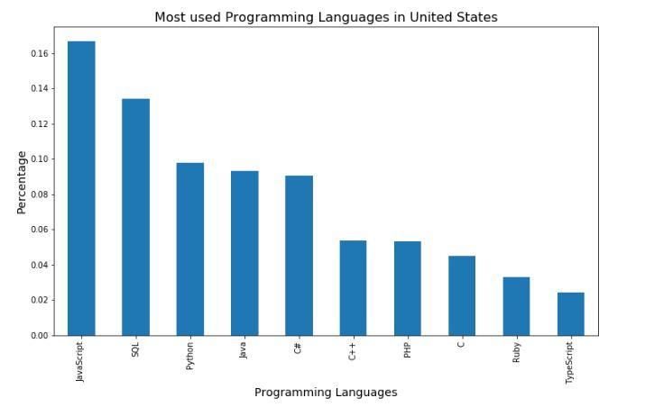
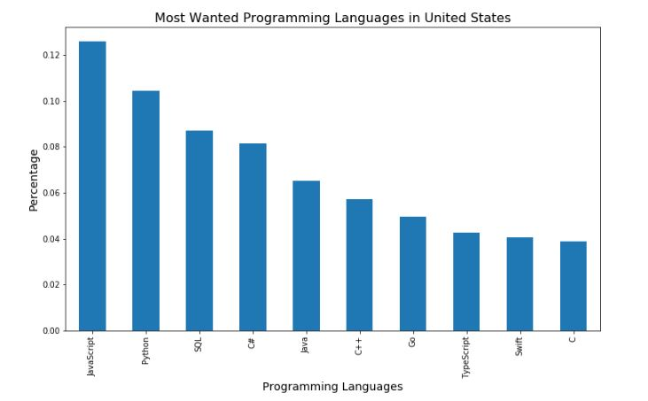
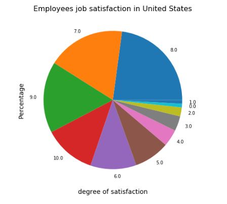
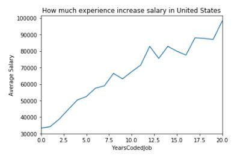

# Are American employees satisfied about their jobs ?  
  &nbsp;
  &nbsp;

&nbsp;

For this project, I was interestested in using Stack Overflow data from 2017 to inswer those questions : 

  - 1. What are the most used programming languages in United States ?
  - 2. What are the most wanted programming languages in United States ?
  - 3. Are American employees satisfied about their jobs ?

###  1.  What are the most used programming languages in United States ?

&nbsp;
  &nbsp;

&nbsp;

After this data exploratory we could easily answer our questions,by looking at the bars chart above we can notice that the most used programming languages are Javascript in the first place then SQL, followed by python and Java.

###  2.  What are the most wanted programming languages in United States ?

&nbsp;
  &nbsp;

&nbsp;

the answer to our question is that Americans are interested in learning Javascript, Python, SQL and C#.

### 3.  Are American employees satisfied about their jobs ?

&nbsp;
  &nbsp;

&nbsp;

By looking at the pie chart above, we notice that most of Americans are highly satisfied about their jobs.

&nbsp;
  &nbsp;

&nbsp;

We notice that experience impact salaries, which means employees with long experience earn the highest salaries 

### Conclusion
  &nbsp;
    &nbsp;
In this article, we took a look at what were the most popular and most biased programming languages, according to Stackoverflow’s 2017 Annual Developer Survey data.

We have seen that some older programming languages such as JavaScript, SQL, and Java still dominates.

Younger programming languages like Python have been well-deserved to be learned, but the oldest ones still have their value and are being much demanded.

We found that most of Americans are highly satisfied about their jobs.

Finally,we looked at how experience impact salaries, and we concluded that employees with long experience earn the highest salaries which is abvious.

To see more about this analysis, see the link to my Github available [here](https://github.com/LailaSabar/introduction-to-data-science/blob/master/Notebook-data-science.ipynb).

